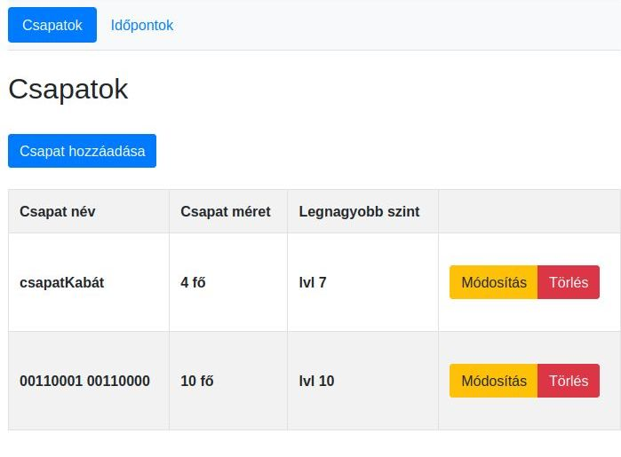
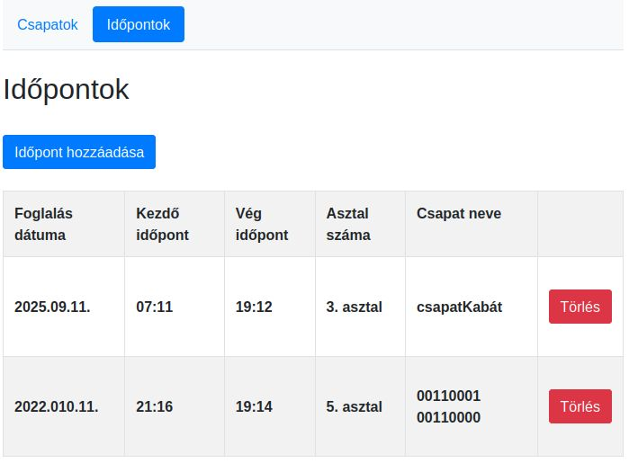

# Simple table reserving webpage for DnD sessions
This project is a simple NodeJS based WebApp using mongoDB as its database.
It was created as a homework to the "Server Side JavaScript" (2022. spring) course.

## Main features:
- Two entity: Csapatok, Idopontok
- Used frameworks and nodeJS libraries
    - Bootstrap, ExpressJS, EJS, Mongoose
    - to Unit Testing: Mocha, Chai
- NodeJS app wrapped with docker-compose
    - MongoDB and WebApp in separated container 

## Use the software
To use the software, You need to docker build the NodeJS app, tag it then start it with docker-compose.
```
DOCKER_BUILDKIT=1 docker build . -t my_nodejs-app
docker tag my_nodejs-app:latest my_nodejs-app:staging
docker-compose up
```



Index page is the Csapatok screen. Here the User can add a new "Csapat" to the DB. 
On this page the User can modify or delete a Csapat.



Second page is the Idopontok screen. Here the User can add a new "Idopont" to the DB. 
On this page the User can only delete (and not modify) an Idopont.

